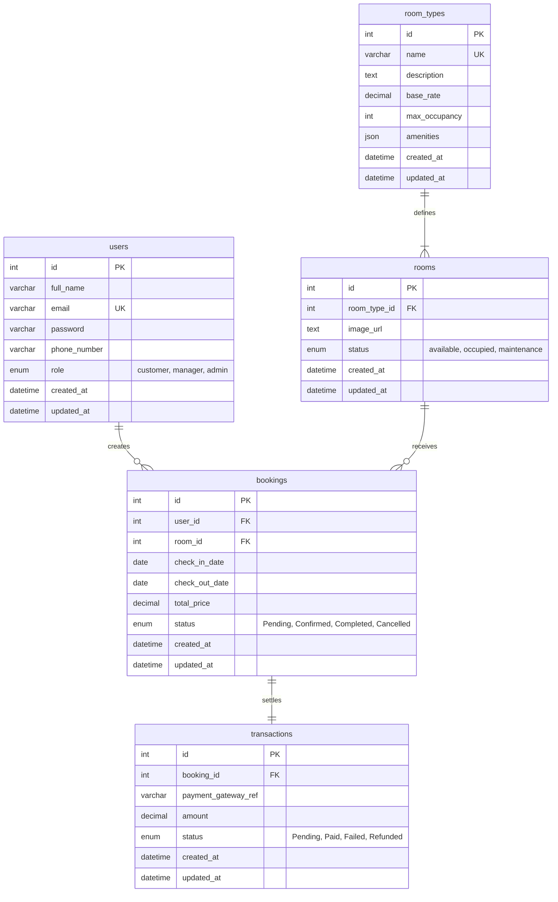

# 09. Entity Relationship Diagram (ERD)

This document visualizes the database relations, tables, primary/foreign keys, and cardinalities of the Hotel Booking System database using a Mermaid.js diagram.

---

## 1. Mermaid.js Entity-Relationship Diagram

---

## 2. Cardinality Descriptions

1. **Users to Bookings (`one-to-many`)**: A user can create zero or many bookings over time; a booking must belong to exactly one user.
2. **Room Types to Rooms (`one-to-many`)**: A room type definition (e.g. Deluxe Suite) can describe many individual rooms; an individual room belongs to exactly one room type.
3. **Rooms to Bookings (`one-to-many`)**: A physical room can be assigned to multiple non-overlapping bookings; a booking is assigned to exactly one physical room.
4. **Bookings to Transactions (`one-to-one`)**: A booking initiates exactly one checkout transaction; a transaction is mapped back to exactly one booking record.
