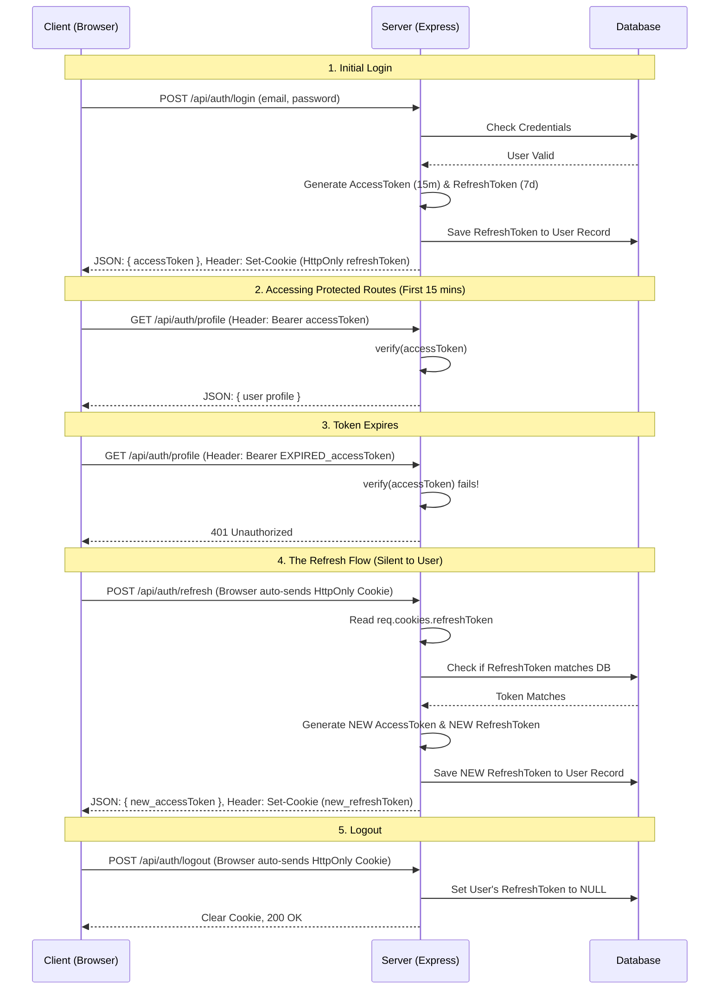

# End-to-End Authentication Flow

This document explains exactly how the Access Token and Refresh Token work together in your `hotel-booking` application, from the moment a user logs in to the moment they log out.

---

## The Sequence Diagram

Here is a visual representation of how the client (e.g., React Web App) and your Node.js server communicate.

---

## Step-by-Step Breakdown

### 1. The Initial Login (`POST /api/auth/login`)
When the user submits their email and password, the server verifies them against the database. 
If successful, the server generates **two** tokens:
- **Access Token:** (Short-lived, e.g., 15 minutes). Sent to the client in the standard JSON response body.
- **Refresh Token:** (Long-lived, e.g., 7 days). Attached to the response via a `Set-Cookie` header. Crucially, this cookie is flagged as `HttpOnly`, meaning JavaScript running in the browser cannot read it. This prevents XSS attacks from stealing the refresh token. The server also saves this token to the database.

### 2. Making API Requests
To make requests to protected endpoints (like viewing a profile or booking a room), the client application attaches the short-lived **Access Token** to the request header:
`Authorization: Bearer <accessToken>`
The Express middleware (`auth.middleware.js`) validates this token. If it's valid, the request proceeds.

### 3. The Expiration (401 Unauthorized)
Since the Access Token expires after 15 minutes, eventually the client will make a request and get a `401 Unauthorized` response. 
**Without a refresh token**, the app would force the user to type their password again.

### 4. The Refresh Process (`POST /api/auth/refresh`)
Instead of redirecting to a login screen, the client application intercepts the `401` error and automatically calls the `/api/auth/refresh` endpoint in the background.
- The browser automatically attaches the `HttpOnly` cookie containing the Refresh Token.
- The server reads the cookie and verifies it against the `JWT_REFRESH_SECRET`.
- The server looks up the user in the database and ensures the token in the database exactly matches the one provided. (This protects against a hacker using a stolen, but validly-signed, token if the user was logged out).
- The server generates a brand new Access Token and a brand new Refresh Token (this is called *Refresh Token Rotation*). 
- It updates the database with the new Refresh Token.
- It returns the new Access Token in JSON and sets the new cookie.
- The client app then retries its original failed API request using the new Access Token! The user never noticed anything happened.

### 5. Logging Out (`POST /api/auth/logout`)
When the user manually clicks "Logout", the client sends a request to the logout endpoint.
- The server identifies the user, goes to the database, and sets their `refreshToken` column to `NULL`. This immediately invalidates the current session.
- The server sends a `Clear-Cookie` instruction to the browser, deleting the HttpOnly cookie.
- The client deletes the Access Token from its memory.
