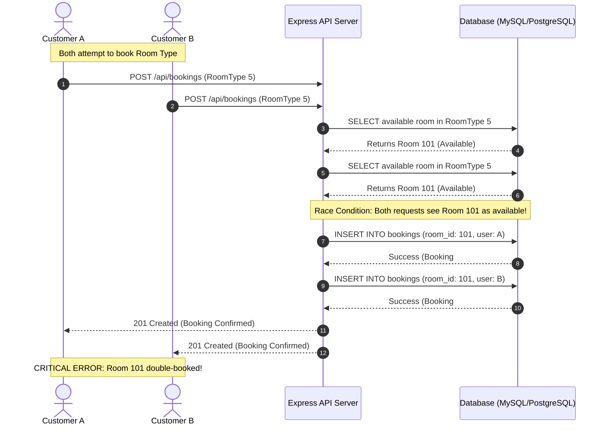

# Race Conditions & Database Transactions in Hotel Room Booking

In a high-concurrency hotel booking system, multiple users may attempt to book the same room type for overlapping dates at the exact same millisecond. Without proper concurrency controls, this leads to **race conditions** and **double bookings**.

This document explains the race condition problem in detail and demonstrates how database transactions with **pessimistic locking** solve it.

---

## 1. The Problem: Race Condition (Without Transactions / Locking)

When two requests execute concurrently without isolation or locking, both requests read the database state *before* either has updated it.

### Step-by-Step Scenario:
1. **Hotel State**: Exactly **1** physical room (Room 101) is available for August 15–18.
2. **User A** and **User B** submit a booking request for August 15–18 simultaneously.
3. **User A** checks availability: Room 101 is free (`available`).
4. **User B** checks availability at the exact same moment: Room 101 is free (`available`).
5. **User A** creates a booking for Room 101.
6. **User B** also creates a booking for Room 101.
7. ❌ **Result**: Double booking! Room 101 is assigned to two different guests for the same dates.

---

### Sequence Diagram: Double Booking Scenario



---

## 2. The Solution: Database Transactions with Pessimistic Write Locks

To eliminate race conditions, the system uses a **Database Transaction** combined with **Pessimistic Locking** (`SELECT ... FOR UPDATE`).

### How It Works:
1. When **User A** initiates a booking, a transaction starts and issues a locked query (`SELECT ... FOR UPDATE`) on the candidate room.
2. The database places an **Exclusive Write Lock** on Room 101 for User A's transaction.
3. When **User B** attempts the same query inside their transaction, the database **forces User B to wait** until User A's transaction finishes.
4. **User A** completes the booking insert and commits the transaction. The lock on Room 101 is released.
5. **User B**'s paused query unblocks and executes. It now sees that Room 101 is already booked and returns `null` (no rooms available).
6. ✅ **Result**: User A gets the room, and User B receives an error/notification that no rooms are available. Overbooking is prevented.

---

### Sequence Diagram: Isolated Transaction with Locking

```mermaid
sequenceDiagram
    autonumber
    actor UserA as Customer A
    actor UserB as Customer B
    participant App as Express API Server
    participant DB as Database

    UserA->>App: POST /api/bookings (RoomType 5)
    UserB->>App: POST /api/bookings (RoomType 5)

    rect rgb(30, 50, 85)
        Note over App, DB: Transaction A Starts
        App->>DB: BEGIN TRANSACTION (A)
        App->>DB: SELECT room WHERE type=5 FOR UPDATE
        Note over DB: DB locks Room 101 for Transaction A
        DB-->>App: Returns Room 101
    end

    rect rgb(85, 35, 45)
        Note over App, DB: Transaction B Starts
        App->>DB: BEGIN TRANSACTION (B)
        App->>DB: SELECT room WHERE type=5 FOR UPDATE
        Note over DB: DB BLOCKS Transaction B (Waiting for Lock)
    end

    rect rgb(30, 50, 85)
        App->>DB: INSERT INTO bookings (room_id: 101, user: A)
        App->>DB: COMMIT TRANSACTION (A)
        Note over DB: Lock on Room 101 Released
        App-->>UserA: 201 Created (Booking Confirmed)
    end

    rect rgb(85, 35, 45)
        Note over DB: Transaction B unblocks and executes query
        DB-->>App: Returns NULL (No available rooms remaining)
        App->>DB: ROLLBACK TRANSACTION (B)
        App-->>UserB: 409 Conflict ("No rooms available")
    end
```



---

## 3. Code Implementation Example (Sequelize)

### Service Layer (`booking.service.js`)
```javascript
import sequelize from '../config/db.js';
import * as roomRepo from '../repositories/room.repository.js';
import * as bookingRepo from '../repositories/booking.repository.js';

const initiateBooking = async (userId, roomTypeId, checkIn, checkOut) => {
  // 1. Managed transaction automatically handles COMMIT on success and ROLLBACK on error
  return await sequelize.transaction(async (t) => {
    // 2. Pass transaction object to repository
    const availableRoom = await roomRepo.findAvailableRoomInType(
      roomTypeId, 
      checkIn, 
      checkOut, 
      t // <--- Passing transaction context
    );

    if (!availableRoom) {
      throw new Error("No rooms available for the selected dates.");
    }

    // 3. Register pending booking
    const booking = await bookingRepo.create({
      user_id: userId,
      room_id: availableRoom.id,
      check_in: checkIn,
      check_out: checkOut,
      status: 'pending'
    }, t);

    return booking;
  });
};
```

### Repository Layer (`room.repository.js`)
```javascript
const findAvailableRoomInType = async (roomTypeId, checkIn, checkOut, transaction) => {
  return await Room.findOne({
    where: {
      room_type_id: roomTypeId,
      status: 'available'
    },
    // Add logic to exclude rooms booked in overlapping dates
    // ...
    transaction, // Connects query to transaction
    lock: transaction ? transaction.LOCK.UPDATE : false // Applies FOR UPDATE lock
  });
};
```

---

## 4. Summary Matrix

| Metric | Without Transactions | With Pessimistic Locks (`FOR UPDATE`) |
| :--- | :--- | :--- |
| **Concurrency Behavior** | Parallel execution without checks | Serialized access on candidate rows |
| **Data Integrity** | Risk of Double Bookings / Data Corruption | High - Strictly atomic |
| **Performance** | Fast, but unsafe | Slightly slower due to waiting locks |
| **Best Used For** | Read-heavy operations (Searching) | Write-heavy critical state operations (Booking/Payment) |
